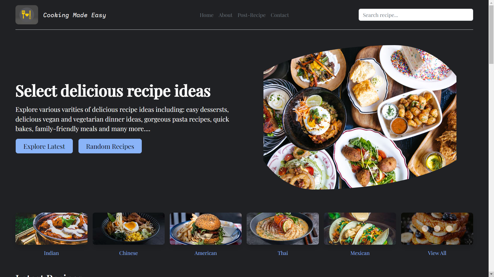

# Cooking made easy

An interactive online platform for culinary enthusiasts, facilitating the discovery, sharing, and enhancement of cooking skills.

## Prerequisites

Before you begin, ensure you have met the following requirements:

- You have installed Node.js and npm on your machine.

## Installing `cookingMadeEasy`

To install `cookingMadeEasy`, follow these steps:

1. Clone the repository: `git clone https://github.com/devilzs1/CookingMadeEasy.git`
2. Navigate into the project directory: `cd cookingMadeEasy`
3. Install the dependencies: `npm install`

## Using cookingMadeEasy

To use email-optimiser, use the following commands:

- To start the development server: `npm start`

  Open [http://localhost:3000]() in your browser to view the app.
- To build the project for production: `npm run build`

  This command will build your app for production to the `dist` folder.
